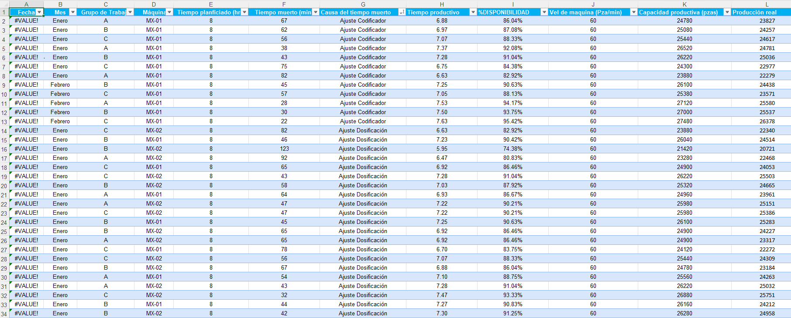
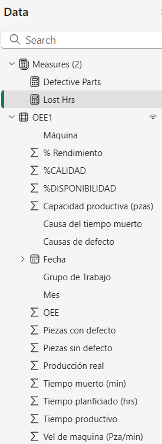
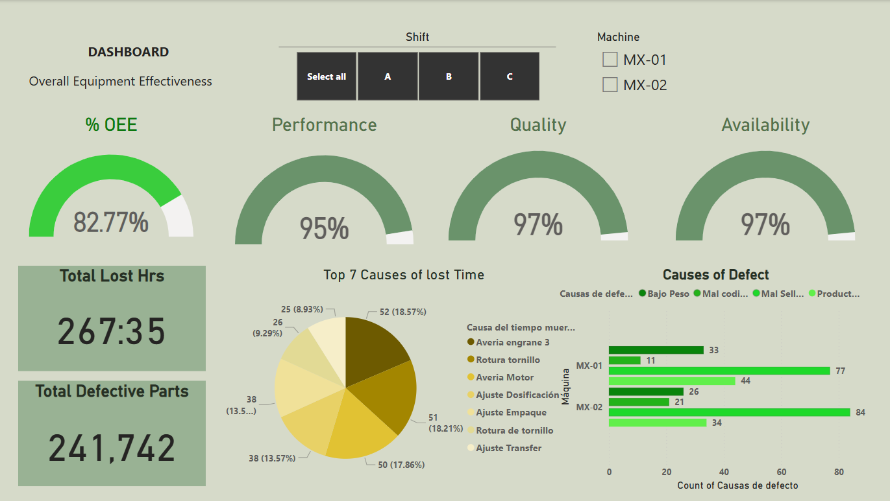

# **Optimizing Downtime and Waste Reduction in Manufacturing with Power BI**

## 📌 Introduction  
In this project, we analyze the most critical areas where processes can be optimized to reduce downtime and maximize the efficiency of two machines that produce a specific product. The goal is to improve machine utilization and reduce waste, leading to better operational performance.

## ⚠️ Problem Statement  
Manufacturing efficiency is often impacted by unplanned downtime and defective products, leading to increased costs and reduced production capacity. Our goal is to identify key improvement points by analyzing historical data to optimize machine operation and minimize defective output.

## 📊 Impact  
- **Increased machine availability** by identifying and reducing downtime causes.  
- **Optimized production performance** by adjusting machine speed and capacity.  
- **Reduction in defective products**, improving overall quality and reducing waste.  
- **Cost savings** by optimizing machine runtime and minimizing defects.

## 📂 Data Set  
The dataset used contains the following key columns:  

```
| **Work Group** | **Machine** | **Planned Time (hrs)** |
| **Downtime (min)** | **Downtime Cause** | **Productive Time** |
| **Availability %** | **Machine Speed (Pcs/min)** | **Production Capacity (pcs)** |
| **Actual Production** | **Performance %** | **Defective Pieces** |
| **Defect Causes** | **Non-Defective Pieces** | **Quality %** |
| **Machine Hourly Cost** | **Cost per Piece** | |
```

## 🔍 Methodology  
1. **Exploratory Data Analysis (EDA)** to understand trends, anomalies, and key downtime causes.  
2. **Data Cleaning and Transformation** using Power BI tools.  
3. **DAX Measures and Calculations** to generate meaningful insights.  
4. **Development of a Dynamic Dashboard** that:  
   - Highlights **total lost hours** and **defective pieces**.  
   - Displays **main impacting factors** side by side.  
   - Allows filtering by **work shift** and **operating machine** combinations.  
5. **Implementation of the OEE (Overall Equipment Effectiveness) index**, calculated in DAX, as a benchmark for performance improvement.

## 📈 Dashboard Overview  
The final dashboard provides an **interactive visualization** that allows users to:  
✅ Identify major causes of downtime.  
✅ Analyze defect trends and their root causes.  
✅ Compare planned vs. actual production output.  
✅ Assess OEE and other key efficiency metrics.  
✅ Drill down by work shifts and machines for deeper insights.  


## 🏁 Conclusions  
- The analysis provided **clear areas of improvement** to minimize downtime and increase machine efficiency.  
- The **OEE index served as a performance benchmark**, guiding data-driven decisions to enhance operations.  
- The dashboard enables **real-time monitoring**, making it easier for decision-makers to **act quickly** on critical inefficiencies.  
- Future iterations may include **predictive analytics** to anticipate failures before they occur.

🔹 **Next Steps**: Integration of machine learning models to predict downtime based on historical trends.


